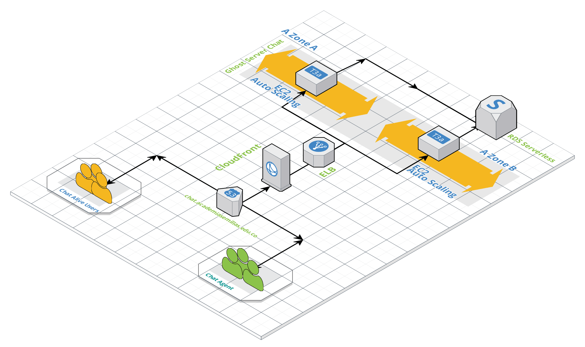

# Internal chat Live Chat for our campus.

We unify our Chat communications for our administrative assistants, teachers and students. 

In addition we contact you in a live chat with our applicants. 

**Used platforms:** AWS of course! 

**Services:** EC2, Route 53, CloudFront, Certificate Manager, S3, S3 Glacier, AWS Backup, Aurora RDS Serverless. 

**Application:** [Rocket.chat](https://Rocket.chat)  

## Features 
Free audio and video conferencing, guest access, screen sharing, file sharing, LiveChat, LDAP Group Sync, two-actor authentication (2FA), E2E encryption, SSO, and dozens of OAuth providers.

**Also includes unlimited:**
Users, Channels, Searches, Messages, Guests, File uploads...

 ----   

 ----   

